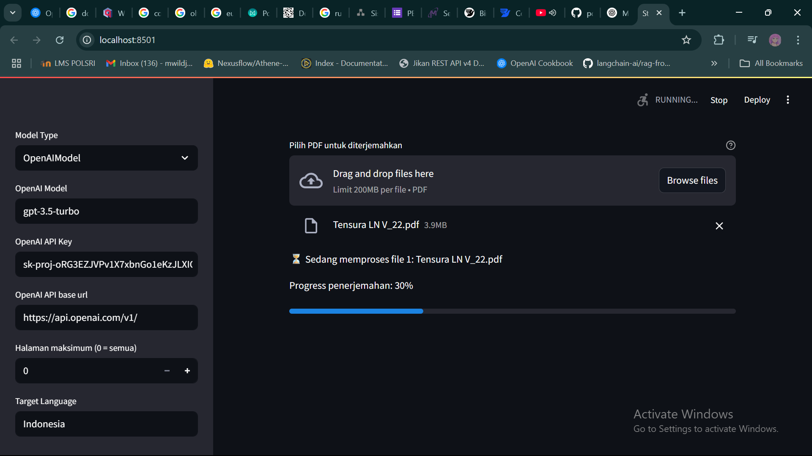

# PDF Translator

<p align="center">
  This repository provides a Web UI and API endpoint for translating PDF files using OpenAI's GPT models, while preserving the original document layout.
</p>

<p align="center">
  
</p>

## 🧠 Overview

**PDF Translator** is a document translation tool powered by Large Language Models (LLMs), specifically designed to convert complex foreign literature and technical documents into clear, easy-to-understand translations. Unlike traditional translation tools, it offers deeper semantic understanding and preserves the original layout and formatting of the document.

---

## 🚀 Key Features

- ✅ **Deep Understanding with LLMs**  
  Uses OpenAI GPT (or compatible models like ChatGLM2) for accurate and fluent translations.

- ✅ **Optimized Reading Experience**  
  - Automatically simplifies dense academic/technical text.
  - Adjustable generation length to suit various reading needs.
  - Efficiently handles high-density information.

- ✅ **Layout Preservation**  
  Translated output keeps the original layout and formatting of the source PDF.

- ✅ **Modular & Extendable**  
  Written in object-oriented Python, making it easy to customize and integrate into other systems.

- ✅ **Interactive GUI**  
  Built with **Streamlit**, supports batch translation, accessible via browser.

---

## 🖥️ Interactive Interface

<p align="center">
  
</p>

Access to GUI via browser. 
```bash
http://localhost:8501/
```

## Installation

1. **Clone this repository**

```bash
   git clone https://github.com/akariwill/PDF-Translator.git
   cd pdf_translator
```

### venv installation

2. **create venv and activate**

prerequesites:
- streamlit, openai.. etc

```bash
python3 -m venv .
source bin/activate
```

3. **install requirements**

```bash
pip3 install -r requirements.txt
```

4. **run**

```bash
streamlit run server.py
```


## License

This project is licensed under GPL-3.0. For more details, please see the [LICENSE](LICENSE) file.